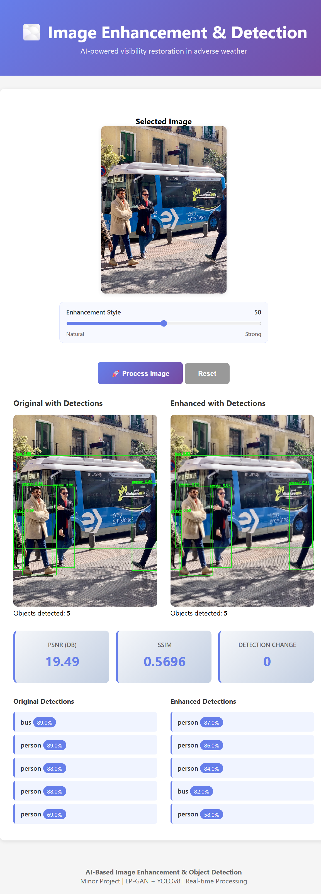
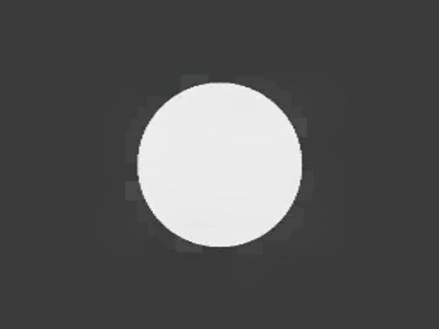

# Fog Detection App

Flask app for image enhancement + YOLOv8 object detection.

## Quick Start (Windows)

### 1) Open terminal in project folder

```powershell
cd C:\Users\Shashank Reddy\fog-detection-app
```

### 2) Create and activate virtual environment

PowerShell:

```powershell
python -m venv venv
.\venv\Scripts\Activate.ps1
```

CMD:

```bat
python -m venv venv
.\venv\Scripts\activate
```

### 3) Install dependencies

```powershell
python -m pip install --upgrade pip
python -m pip install --index-url https://download.pytorch.org/whl/cpu torch torchvision
python -m pip install -r requirements.txt
```

### 4) Run app

```powershell
python app.py
```

Open in browser: http://127.0.0.1:5000

## Usage

1. Upload image.
2. Move `Enhancement Style` slider:
   - low = natural
   - high = strong
3. Click `Process Image`.

## Output Samples

Live website output captured from the app:

<p align="center">
   
</p>

Additional processing examples:

<table>
   <tr>
      <td align="center">
         <strong>Input</strong><br>
         
      </td>
      <td align="center">
         <strong>Enhanced</strong><br>
         
      </td>
   </tr>
   <tr>
      <td align="center">
         <strong>Original Detections</strong><br>
         
      </td>
      <td align="center">
         <strong>Enhanced Detections</strong><br>
         
      </td>
   </tr>
</table>

## Full Setup Guide

See `SETUP_GUIDE.md` for troubleshooting and detailed setup steps.
